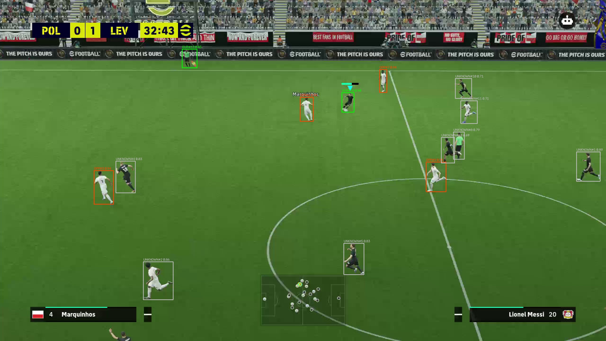

# FALS — Football AI Learning System

A research-oriented **Computer Vision + Reinforcement Learning system for learning football decision-making from visual game environments**.

The project is currently being developed and evaluated in **eFootball as its primary learning environment**.

The system combines:

* **Computer Vision** — detecting players, the ball, active-player markers, and score information;
* **Realtime Tracking** — maintaining stable player and ball state between detector updates;
* **World Modeling** — reconstructing a structured football state from visual observations;
* **Tactical Decision-Making** — interpretable football heuristics used for bootstrap and evaluation;
* **Reinforcement Learning** — semantic 170-dimensional observations with structured categorical PPO;
* **Realtime Control** — translating semantic actions into XInput controller input;
* **Safety & Validation** — fail-closed control based on perception and world-state confidence.

```text
Computer Vision
       ↓
Realtime Tracking
       ↓
World Model
       ↓
Tactical / RL Decision
       ↓
Safety Gate
       ↓
XInput Control
       ↓
Learning Environment
```

> **Status:** Experimental / Research
> **Current architecture:** V17
> **Current learning environment:** eFootball
> **RL status:** Bootstrap + experimental PPO
> **Planned:** V24 / V24.1



## What is being learned?

The long-term goal is to develop a football-playing policy that can make increasingly complex decisions from a structured representation of the game.

The current research focuses on learning and evaluating:

* spatial awareness;
* player control;
* possession behavior;
* attacking movement;
* passing and shooting decisions;
* pressing and ball recovery;
* action timing;
* tactical decision-making.

The project deliberately separates **perception, world-state estimation, tactical reasoning, learning, and control** instead of training a single end-to-end pixel-to-action model.

## Current Learning Pipeline

The current runtime uses an interpretable tactical planner as a bootstrap teacher.

```text
Visual Observation
        │
        ▼
   WorldState
        │
        ├───────────────┐
        ▼               │
Tactical Planner        │
        │               │
        ▼               │
Teacher Actions         │
        │               │
        └──────┐        │
               ▼        │
       Behavior Cloning │
               │        │
               ▼        │
          Structured PPO◄┘
               │
               ▼
        Semantic Actions
               │
               ▼
          Safety Gate
               │
               ▼
         XInput Control
```

The bootstrap phase is not a separate prototype: it is part of the current runtime. The system collects valid WorldState/action pairs from the heuristic planner, performs behavior-cloning updates, and then transitions to on-policy PPO once the configured teacher stage is complete.

## Semantic Reinforcement Learning

The learning system does not feed raw pixels directly into PPO.

The current semantic encoder exposes a **170-dimensional observation contract** containing information such as:

* ball position, velocity, confidence, and validity;
* control and designated players;
* up to 11 own and 11 opponent players;
* possession state and confidence;
* score and match clock;
* tactical features;
* world/control/temporal validity;
* temporal ball displacement and persistence;
* possession owner;
* game mode;
* predicted ball positions at multiple horizons.

The PPO policy uses separate categorical heads for:

```text
Movement:       9 actions
Football:       6 actions
Sprint:         2 actions
```

with a shared neural representation and value head. The current implementation includes GAE, clipped PPO updates, entropy regularization, gradient clipping, minibatch training, and target-KL stopping.

The 170-dimensional representation is already implemented in the current encoder. Future V24/V24.1 work is focused on refining the state contract and learning architecture rather than introducing semantic observations from scratch.

## Realtime Perception

A major engineering challenge is that visual detection is not instantaneous or perfectly reliable.

The current perception stack therefore does not depend on obtaining a fresh detector result for every processed frame.

RT-DETR operates asynchronously while the realtime perception loop continues using:

* latest-frame semantics;
* bounded pending work;
* detector source timestamps;
* detector-age tracking;
* player tracking;
* local optical-flow recovery;
* bounded prediction;
* active-player temporal memory;
* ball temporal prediction;
* confidence and validity gates.

The world model exposes explicit validity information so that perception uncertainty can propagate into control decisions instead of being silently ignored.

## Why the World Model Matters

The system explicitly separates several concepts that are easy to conflate in a visual football environment:

```text
Active Player
       ≠
Designated Player
       ≠
Possession Owner
```

These identities are maintained independently because the player currently controlled by the game, the player most relevant to the tactical layer, and the player believed to own the ball are not necessarily the same.

The current world model also maintains temporal history, game mode, score, tactical features, predictions, and confidence/validity information.

## Deterministic Tactical Bootstrap

The tactical planner is deliberately small and inspectable.

Instead of trying to learn all football behavior from random exploration immediately, it provides an interpretable initial policy based on structured WorldState.

Current decisions include:

* moving toward the opponent goal;
* shooting when position and shot quality are sufficient;
* passing when space and expected threat justify it;
* crossing in advanced positions;
* pressing when the opponent controls possession;
* moving a nearby player toward a loose ball.

The planner is used as a teacher for the initial behavior-cloning stage before PPO becomes the active policy.

## Reward Design

The reward system is intentionally **goal-first with bounded shaping**.

Current event rewards include:

```text
Goal for        +10.0
Goal against    -10.0
Shot on target   +1.0
Ball won        +0.5
Ball lost       -0.6
```

Additional shaping uses:

* possession reward;
* forward ball progress;
* bounded retreat shaping.

Shaping is clipped so that local movement rewards do not overwhelm major football events such as scoring or conceding.

## Safety and Control

The control layer is deliberately fail-closed.

A policy action does not automatically become controller input: it must first pass the world/control validity gate.

The current runtime requires sufficiently reliable perception, a usable active player, enough recent player tracks, valid game state, and bounded ball-prediction conditions before allowing control. Otherwise the system falls back to a neutral action.

This makes perception uncertainty an explicit part of the control contract rather than an afterthought.

## Current Status

### V17 — Current

V17 is the current implemented architecture.

Its primary focus is **realtime reliability and temporal state reconstruction**.

Current implemented components include:

* asynchronous RT-DETR;
* player detection and tracking;
* team classification;
* cyan-marker active-player detection;
* local optical-flow recovery;
* ball tracking and prediction;
* possession estimation;
* designated-player selection;
* temporal world-state fusion;
* score detection;
* game-mode estimation;
* tactical bootstrap planning;
* semantic 170D state encoding;
* structured categorical PPO;
* behavior-cloning bootstrap;
* safety-gated XInput control.

The PPO implementation is functional as an experimental learning component, but it should **not** be interpreted as a finished or well-trained football-playing policy yet. The current work is focused on building a stable perception → state → action foundation on which stronger learning experiments can be evaluated.

### V24 / V24.1 — Planned

V24/V24.1 are the next planned iteration.

The goal is to preserve the strongest V17 realtime work while refining the contracts between:

```text
Perception
    ↓
World Model
    ↓
Tactical Layer
    ↓
Reinforcement Learning
    ↓
Control
```

Planned work includes:

* refined perception/world/control contracts;
* improved semantic WorldState;
* improved observation design;
* structured categorical PPO improvements;
* teacher/bootstrap improvements;
* richer reward design;
* stronger tactical behavior;
* improved event and game-phase handling;
* improved training/evaluation infrastructure;
* more robust automated match evaluation.

V24/V24.1 are **future architecture targets**, not claims about the currently validated capabilities of the system.
